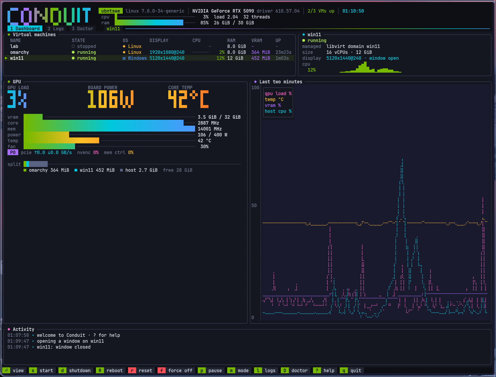
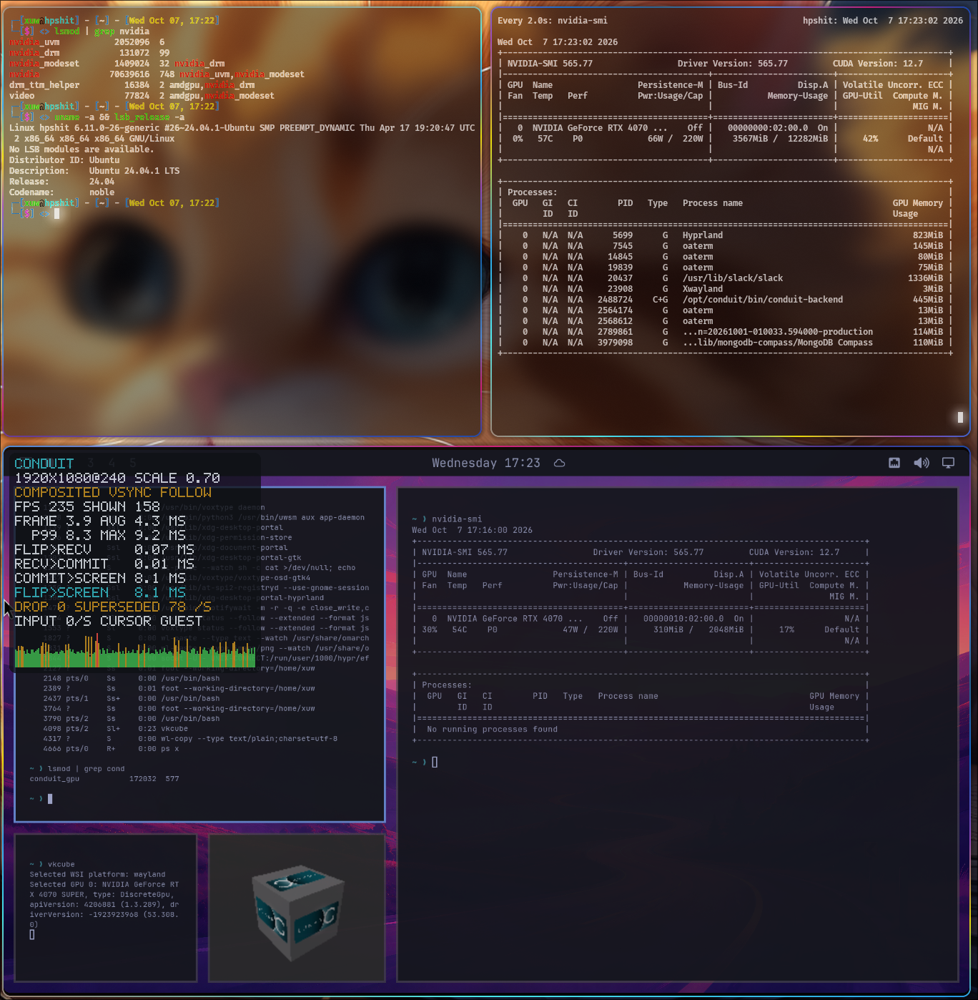
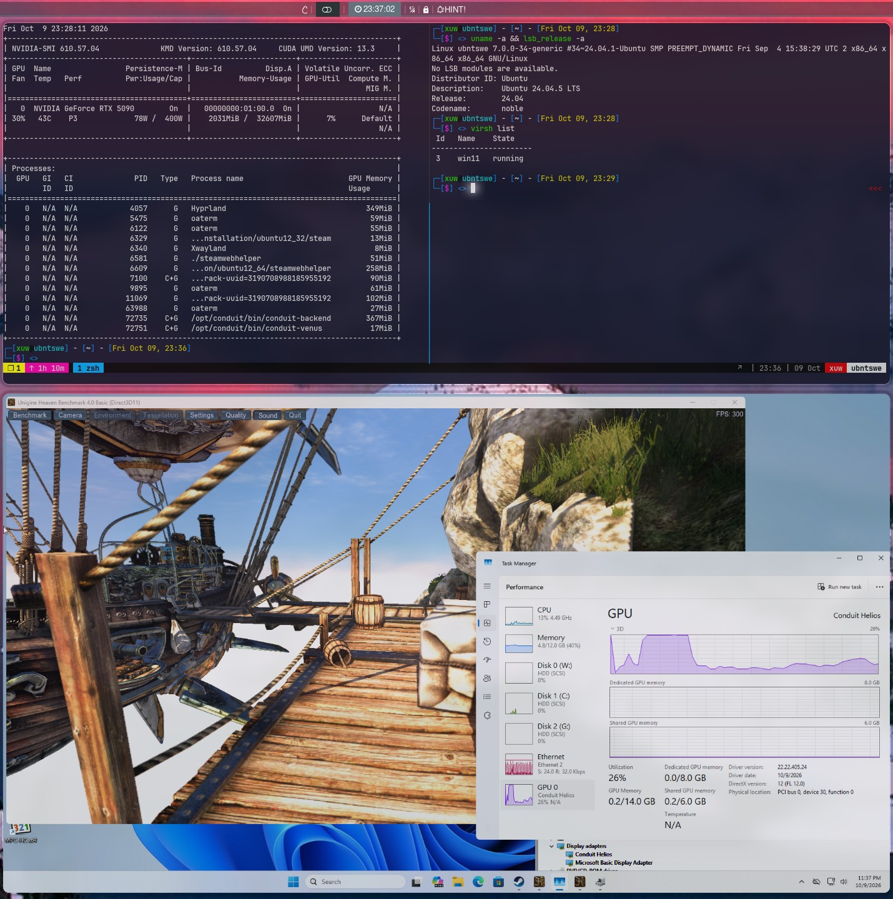

#  Conduit

**Share your NVIDIA GPU with a virtual machine and see its desktop on yours.**

<p align="center">
  
</p>

Conduit lets a Linux VM use your real NVIDIA graphics card (games, Vulkan,
OpenGL, CUDA, video encoding) while your own desktop keeps using it too. The
VM's screen appears as a normal window on your desktop. Frames go straight
from GPU memory to your screen: no copying, no video compression.

- One GPU, shared. No second graphics card, no passthrough, no vGPU license.
- Up to your monitor's refresh rate (tested at 240 Hz).
- Mouse, keyboard, clipboard (copy/paste both ways) and sound just work.
- Play it from another computer, phone or TV with [Moonlight](https://moonlight-stream.org).
- Start, pause and stop VMs from virt-manager / virsh, or with `conduit` commands.

### What works

| | |
|---|---|
| Vulkan, OpenGL, EGL (apps, games) | ✅ |
| CUDA (incl. large managed and pinned memory) | ✅ |
| Video encode/decode (NVENC/NVDEC) | ✅ |
| Desktop in a window, up to 240 Hz, zero-copy | ✅ |
| Clipboard both ways, sound (speakers + mic) | ✅ |
| Streaming to Moonlight (AV1/HEVC/H.264, up to 240 fps) | ✅ |
| virt-manager / virsh (start, pause, reboot, stop; attach to existing VMs) | ✅ |
| Windows 11 VMs: desktop/DWM, D3D11, D3D12, Vulkan, OpenGL (Zink) on NVK-on-RM, up to 240 Hz | experimental, opt-in (`--venus`, driver 22.22.405.24 built by hand: [Windows guests](#windows-guests)) |
| NVK (Mesa's open Vulkan driver) on NVIDIA's kernel driver, in a Linux VM | experimental, opt-in (`NVK_RM=1`: [guest/nvk-rm](guest/nvk-rm/README.md), [librmclient](guest/rmclient/README.md)) |

> Early software, tested mainly on an RTX 5090 with Ubuntu 24.04 and Hyprland;
> also run on an RTX 4070 SUPER ([GPU support](docs/GPU-SUPPORT.md)). Windows
> guests are experimental and test-signed ([docs/WINDOWS.md](docs/WINDOWS.md)).

<p align="center"><b>Linux VM</b></p>

<p align="center">
  
</p>

<p align="center"><sub>One RTX 4070 SUPER shared between an Ubuntu host (top) and an Omarchy guest running <code>vkcube</code> at 240 Hz (bottom).</sub></p>

<p align="center"><b>Windows 11 VM</b></p>

<p align="center">
  
</p>

<p align="center"><sub>A Windows 11 guest on an RTX 5090: Unigine Heaven in Direct3D 11 at 300 fps, rendered by NVK on the host GPU.</sub></p>

### Windows guests

#### Set up a Windows 11 VM (4 steps)

1. **Host packages.** Install Conduit from the [release](https://github.com/olealgoritme/conduit/releases)
   (`.deb`, `.rpm` or Arch), plus `ovmf` and `swtpm` for UEFI and TPM 2.0.
2. **Make the VM.** In virt-manager, create a normal Windows 11 VM (UEFI/OVMF,
   TPM 2.0, **Secure Boot off**: the guest driver is test-signed) and install
   Windows. [docs/examples/win11.xml](docs/examples/win11.xml) is a working example.
3. **Give it Conduit's GPU** (VM shut off), then start it. Windows VMs need `--venus`:
   ```bash
   conduit attach win11
   conduit up win11 --venus --display 5120x1440@240   # your monitor's mode
   conduit view win11                                 # the window
   ```
4. **Install the guest driver.** Download `conduit-windows-gpu-driver-<version>.zip`
   from the same release into the VM, unzip it, and from an **Administrator**
   prompt in that folder run `powershell -ExecutionPolicy Bypass -File .\install.ps1`
   (Windows blocks downloaded scripts otherwise; the script itself turns on
   test-signing and trusts the driver's test certificate). The first run asks you
   to reboot. Run it again after the reboot, then reboot once more. Device Manager
   then shows **Conduit Helios** and Windows runs at the mode from step 3.

**Playing games:** press **Ctrl+Alt+G** in the viewer to grab the mouse (games
need relative mouse input), and run games at the VM's display mode (e.g.
5120x1440, "Fullscreen Windowed"). The guest has no scaler, so a lower game
resolution does not fill the screen. Ctrl+Alt+G again releases the mouse.

More detail (building the driver yourself, knobs, troubleshooting):
[docs/WINDOWS.md](docs/WINDOWS.md).

#### How it works


A Windows 11 guest renders on the host GPU through NVK-on-RM: Mesa's open
NVK Vulkan driver runs in the guest and talks to the host's NVIDIA kernel
driver (RM) through Conduit. Tested on an RTX 5090. Guest driver version:
**22.22.405.24**.

```
 Windows guest
   app (D3D11 / D3D12 / Vulkan / OpenGL)
     → Helios UMDs: D3D11 on DXVK, D3D12 on vkd3d-proton, OpenGL on Zink
     → NVK-on-RM (Mesa NVK + librmclient)
     → Helios WDDM KMD (display, flips, cursor, RM calls over virtio)
 Host
   conduit-backend: forwards the RM calls to the NVIDIA driver, serves the
                    display (scanout, EDID, cursor, presentation feedback)
     → GPU; finished frames go zero-copy as dma-bufs to
   conduit view (the viewer window) or the stream
```

The desktop (DWM) and games run on NVK. Venus (Vulkan replayed by the host's
NVIDIA Vulkan driver in `conduit-venus`) stays as the fallback for processes
the per-process policy keeps off NVK.

**Results** (RTX 5090, desktop and games on NVK at 240 Hz):

| Counter-Strike 2 | fps |
|---|---|
| 1920x1080 | ~330–380 |
| 5120x1440, with bots | ~350 |
| lower resolutions | ~400–500 |

**Main knobs** (defaults in force; registry values are `REG_DWORD`, NVK
settings are environment variables of the process):

| Knob | Default | What it does |
|---|---|---|
| `IndepFlip` (KMD service key) | 0 | independent flip for full-screen flip-model windows; 1 turns it on |
| `DirectFlipSupport` (`HKLM\SOFTWARE\Helios`) | 0 | the D3D11.1 `CheckDirectFlipSupport` answer DWM uses for independent flip; 1 with `IndepFlip=1` |
| `HwCursor` (KMD service key) | follows `IndepFlip` | the hardware cursor; absent means on with independent flip, off without |
| `NVK_INDIRECT_PUSH` | 0 | indirect draw records through the pushbuffer |
| `NVK_NULL_VB_ZERO_PAGE` | 1 | null vertex buffers bound to the zero page |
| `NVK_ZERO_PAGE_VRAM` | 1 | the zero page (null descriptors) in VRAM |
| `NVK_RM_BAR_MB` | 0 | host-visible VRAM heap through BAR1; 0 off, -1 all of BAR1, N MiB |

**Diagnostics** (written to `%ProgramData%\Helios\` per process):

| Variable | Output |
|---|---|
| `NVK_PASS_PROFILE=1` | GPU time per render pass signature, per operation outside passes and per command buffer, with the shaders each pass used (`nvk-pass-<pid>.txt`) |
| `NVK_PASS_PROFILE=2` / `3` | adds pipeline statistics (vertex, clipper, pixel invocations) / ZCULL statistics |
| `NVK_PASS_PROFILE=4` | adds a histogram of the 3D methods written per pass |
| `NVK_PASS_PROFILE=5` | dumps one render pass's draws (`NVK_PASS_DUMP` picks it) |
| `NVK_SHADER_STATS=1` | NAK statistics of every uploaded shader (`nvk-shaders-<pid>.txt`) |
| `NVK_WAIT_STATS=1` | CPU wait counts and times per site, once a second (`nvk-waits-<pid>.txt`) |

**Known limitations:**

- The guest has a single display mode, the host monitor's (5120x1440 on the
  test machine), with no scaling: a game at a lower resolution is not
  stretched to fill the screen.
- In games, use the viewer's mouse grab (`Ctrl+Alt+G`) for mouse look.
- Independent flip is off by default (`IndepFlip=0`, `DirectFlipSupport=0`):
  full-screen games are composed by DWM.
- The driver is test-signed (Secure Boot off, test-signing on), and the guest
  package is built and installed by hand.

More:

- [docs/WINDOWS.md](docs/WINDOWS.md): set up the VM, build and install the
  driver package, the registry knobs
- [guest/nvk-rm/README.md](guest/nvk-rm/README.md): the NVK-on-RM patch
  series and its knobs
- [docs/NVK-ROADMAP.md](docs/NVK-ROADMAP.md): what is left
- [docs/SECOND-MACHINE.md](docs/SECOND-MACHINE.md): the whole setup on another
  NVIDIA host
- [docs/KNOWN-ISSUES.md](docs/KNOWN-ISSUES.md#windows-guests): limits

## What you need

| | |
|---|---|
| Host | Linux, x86-64, with KVM (`ls /dev/kvm` works) |
| GPU | NVIDIA, Turing (RTX 20xx) or newer. Run so far: RTX 5090 (reference), RTX 4070 SUPER (one Linux-guest session) |
| Host driver | A release Conduit has ABI tables for (535.129.03, 565.77, 580.178.04, 595.71.05, 595.99.02, 595.104.02, 610.43.02, 610.43.03, 610.57.04, 615.71.09, 615.78.08; `conduit doctor` lists them). Tested with the **open** kernel modules, 580 or newer; the closed modules and older branches are accepted when the release has tables, with a warning that they are untested |
| Desktop | Any Wayland desktop (GNOME, KDE, Hyprland, Sway, …) |
| VM | Linux, kernel 6.4 or newer: Ubuntu 24.04 recommended (`conduit create`); `conduit attach` also sets up Debian and Arch-based VMs (Arch, Omarchy, EndeavourOS, Manjaro). Windows 11: experimental ([docs/WINDOWS.md](docs/WINDOWS.md)) |

## Quick start

1. **Download** the package for your Linux from the
   **[latest release](https://github.com/olealgoritme/conduit/releases/latest)** and install it (table below).
2. **Check your computer:** `conduit doctor`. A line marked `FAIL` needs fixing
   (it says how); `warn` lines are expected with a closed or older NVIDIA driver
   and mean Conduit starts in safe mode. First time? `conduit setup` walks you
   through all of this, up to a first working VM.
3. **Make a VM:** `conduit create myvm` (downloads Ubuntu, installs a GNOME
   desktop and the GPU driver; takes a few minutes).
4. **Open it:** `conduit view myvm`. A window with the VM's desktop appears.

## Install

Download the package for your system from the
**[latest release](https://github.com/olealgoritme/conduit/releases/latest)**, then:

| System | Install |
|---|---|
| Ubuntu / Debian / Pop!_OS / Mint | `sudo apt install ./conduit_*_amd64.deb` |
| Fedora / RHEL / openSUSE | `sudo dnf install ./conduit-*.x86_64.rpm` (openSUSE: `sudo zypper install ./conduit-*.rpm`) |
| Arch / Manjaro / EndeavourOS | `sudo pacman -U ./conduit-*-x86_64.pkg.tar.zst` |
| NixOS | `nix run github:olealgoritme/conduit` (flake) |
| Anything else | `tar xf conduit-*-x86_64-linux.tar.gz && sudo ./conduit/install.sh` |

### Ubuntu: everything else the host needs

The package brings Conduit's own QEMU, virglrenderer and the viewer. The rest
comes from Ubuntu:

```bash
sudo apt install libvirt-daemon-system libvirt-clients virt-manager \
                 qemu-utils ovmf swtpm swtpm-tools       # VMs; OVMF + swtpm for Windows 11
sudo usermod -aG kvm,libvirt "$USER"                      # then log out and back in
```

Plus the NVIDIA **open** kernel modules and the NVIDIA Vulkan driver of a
supported release (`conduit doctor` names it; list in
[docs/SECOND-MACHINE.md](docs/SECOND-MACHINE.md)). For Windows 11 also grab
the ISOs with `quickget windows 11` (`sudo apt install quickemu`), see
[docs/SECOND-MACHINE.md](docs/SECOND-MACHINE.md).

**AppArmor** (Ubuntu confines libvirt) needs nothing by hand: installing the
package runs `/opt/conduit/libexec/conduit-integrate enable`, which adds one
marked line each to `/etc/apparmor.d/local/abstractions/libvirt-qemu`,
`local/usr.lib.libvirt.virt-aa-helper` and `local/usr.sbin.libvirtd` (so
libvirt may start the bundled QEMU and open its sockets) and reloads those
profiles. `conduit doctor NAME` checks it; `conduit-integrate disable` (run on
package removal) takes the lines out again. Details:
[docs/LIBVIRT.md](docs/LIBVIRT.md).

Then:

```bash
conduit doctor            # checks KVM, the NVIDIA driver, your desktop
conduit create myvm       # a ready-made Ubuntu VM with GNOME
conduit view myvm         # open it in a window
```

That's it. The VM gets your monitor's resolution and refresh rate
automatically.

### The dashboard

Run `conduit` on its own: every VM, the host and the GPU live, with one-key
view, start, shutdown, reset and logs (`?` lists the keys).

### Everyday commands

| Command | What it does |
|---|---|
| `conduit view myvm` | Open the VM in a window (starts it if needed) |
| `conduit up myvm` | Start in the background (`conduit view myvm` attaches a window any time) |
| `conduit down myvm` | Shut down cleanly; forced off after 30 s (`--timeout N`, `--force` = now) |
| `conduit shutdown myvm` / `conduit reboot myvm` | Press the power button and wait / restart the guest cleanly |
| `conduit pause myvm` / `conduit resume myvm` | Freeze / continue the VM |
| `conduit reset myvm` / `conduit poweroff myvm` | Hard reset / turn off immediately |
| `conduit doctor myvm` | Check everything one VM needs |
| `conduit status` | What is running |
| `conduit ssh myvm` | A terminal inside the VM |
| `conduit logs myvm` | Logs when something goes wrong |
| `conduit list` | Your VMs |
| `conduit` | The live dashboard (above) |

> **VM runner:** the package brings its own QEMU 11.1 (in `/opt/conduit`), so
> it works on systems whose QEMU is too old (for example Ubuntu 24.04). Your
> system QEMU is never touched. The VM gets a sound card (speakers and
> microphone) through your desktop's PipeWire or PulseAudio. If that QEMU is
> missing, Conduit falls back to its small built-in runner, which has no sound
> (`--vmm builtin` picks it on purpose).

### Build from source

```bash
git clone https://github.com/olealgoritme/conduit && cd conduit
make deps      # build dependencies (asks for sudo)
make           # backend, VM runner, CLI, viewer, guest module, bundled QEMU
make test      # offline tests
make install   # installs to /opt/conduit (+ /usr/local/bin/conduit)
```

Maintainers: `make release` tags the next version (`release-minor`, `release-major`,
or `packaging/release.sh X.Y.Z`); GitHub then builds every package for that tag.

## Keys inside the viewer

| Keys | What it does |
|---|---|
| `Ctrl+Alt+F` | Fullscreen on/off |
| `Ctrl+Alt+G` | Capture the mouse (for games) / release it |
| `Ctrl+Alt+O` | Performance overlay on/off (fps, frame times, latency) |
| `Ctrl+Alt+D` | Direct mode: lowest latency (fullscreen, no overlay) |
| `Ctrl+Alt+R` | Switch between the VM's resolution following the window (default) and scaling a fixed resolution into it |

## Play it from another computer (Moonlight)

Stream the VM to any device with [Moonlight](https://moonlight-stream.org)
(Windows, macOS, Linux, Android, iOS, TVs, Steam Deck). No Sunshine needed:
Conduit is the server.

1. On this computer: `conduit stream myvm`
2. In Moonlight: click **+**, type this computer's IP (or `localhost` on the
   same machine). Moonlight shows a **PIN**.
3. On this computer: `conduit stream pair 1234` (the PIN you see).
4. In Moonlight: click the computer, then the app named after your VM (**myvm**).

**Settings** (resolution, **FPS** up to 240, **bitrate**, **codec** AV1/HEVC/H.264):
the **gear icon ⚙** on Moonlight's start screen, before you start the stream.
The VM switches to the resolution you pick automatically.

In a stream: **Ctrl+Alt+Shift+Q** quits, **Ctrl+Alt+Shift+Z** captures or
releases mouse and keyboard. Keyboard, mouse and gamepads go to the VM.
`conduit view myvm` and `conduit stream myvm` can run at the same time, started in either order.

`conduit stream myvm --service` keeps streaming in the background. Conduit's
own viewer can connect too (`conduit stream myvm --link` here,
`conduit remote THIS-PC --lossless` there; lossless needs ~1 Gbit/s+).
Details: [docs/STREAMING.md](docs/STREAMING.md).

## virt-manager and virsh

Conduit VMs are ordinary libvirt VMs: start, pause, resume, reboot and shut
them down from virt-manager or `virsh` like any other, while the GPU, the
`conduit view` window and the clipboard keep working. They live in libvirt's
**user session** (`qemu:///session`, QEMU runs as you). In virt-manager, open it
once with **File > Add Connection > Hypervisor: QEMU/KVM user session**.

**A) Beginner: a new VM**

```bash
conduit create myvm      # builds it and registers it with libvirt (--no-libvirt: don't)
conduit view myvm        # starts it and opens its screen
```

**B) A VM you already have in virt-manager**

```bash
conduit attach myvm      # backs up its definition, adds the GPU, installs the guest driver
# start it in virt-manager (or: virsh -c qemu:///session start myvm)
conduit view myvm        # its screen, in a Conduit window
conduit detach myvm      # later, if you want: the original definition comes back
```

`attach` installs the guest driver through the QEMU guest agent when the VM
runs one (Debian/Ubuntu or Arch-based guests; on Arch install it first:
`sudo pacman -S qemu-guest-agent`, then reboot the VM); otherwise it prints
the one command to run. It works for VMs in
`qemu:///system` too (`conduit attach myvm -c qemu:///system`). Conduit's QEMU
has no SPICE: attach replaces the VM's SPICE display with Conduit's boot
console (firmware, boot menu and disk-unlock prompt in the Conduit window).
A VM made before this: `conduit libvirt enable myvm` (and `disable` to undo).

The window and the VM have separate lives: closing the window leaves a VM
running unless `conduit view` itself started it (then it shuts down, unless
you pass `--keep-running` or set `conduit config set view.close_stops_vm false`).
`conduit view myvm` reattaches at any time. Each VM also gets an app-menu entry,
"myvm (Conduit VM)".

Not supported for these VMs: saving their memory to disk (virt-manager "Save",
`virsh managedsave`), snapshots with memory, and migration. The GPU's state
lives in the host driver, and libvirt refuses these. `conduit doctor myvm`
checks the whole chain. Details: [docs/LIBVIRT.md](docs/LIBVIRT.md).

## How it works (short version)

```
 VM: apps → NVIDIA's own driver libraries → Conduit guest driver
                                              │  (virtio)
 Host:                                Conduit backend → your NVIDIA driver → GPU
                                              │  (zero-copy frame handoff)
 Host desktop:                        Conduit viewer window
```

The VM runs NVIDIA's real user-space driver. Conduit passes its requests to
your host's driver, so the VM renders on the real GPU. Finished frames already
live in GPU memory, so the viewer shows them directly. Details:
[docs/ARCHITECTURE.md](docs/ARCHITECTURE.md).

## Is it safe?

The VM runs as an unprivileged, sandboxed process on your host and cannot
touch your display settings or other apps' GPU work. It is not hardware
isolation like a dedicated GPU: only run VMs you trust. See
[docs/SECURITY.md](docs/SECURITY.md).

The guest's video memory comes out of the same card as your desktop. On a
driver or GPU that is not the tested one (the closed NVIDIA modules, a driver
before 580), Conduit starts in **safe mode**: a 2 GiB video-memory limit (a smaller
`gpu.vram_limit_mib` stays) and
1 s bounds on blocking GPU calls; `conduit doctor` shows whether it is on and
why. Cards other than the RTX 5090 (Ada, Ampere, Turing) have not been run
yet: for a first run keep an ssh session or a text console open on the host
([docs/GPU-SUPPORT.md](docs/GPU-SUPPORT.md)). To check that a change leaves the
tested setup alone, see [docs/PROVEN-SETUP-CHECK.md](docs/PROVEN-SETUP-CHECK.md).

## Troubleshooting

| Problem | Try |
|---|---|
| `conduit view` says no KVM | Enable virtualization (VT-x / AMD-V) in your BIOS |
| Black window | `conduit status myvm`, then `conduit logs myvm` |
| Low fps when idle | Normal: the VM only draws when something changes |
| Short stutters or freezes in the VM, benchmark numbers that swing | The host is starving it (swap, builds on its cores): see [host tuning](docs/HOST-TUNING.md) |
| "not enough free memory" | Close apps or give the VM less RAM; `--no-mem-check` skips the check |
| Overlay says `COMPOSITED` in fullscreen | Your desktop composites the window; see [direct scanout](docs/SCANOUT.md). On Hyprland: `conduit view myvm --tune-hyprland`, then `Ctrl+Alt+F`, `Ctrl+Alt+D` |
| Stream: "ports are in use" | Another `conduit stream` or Sunshine is running; stop it, or use `--port 48089` |
| Moonlight: Windows/Super key does nothing | Moonlight settings → *Capture system keyboard shortcuts* → **Always** |
| Steam window errors | Steam is an X11 app and needs XWayland in the VM's session; open an issue with `conduit logs myvm` |
| An app fails or is slow on the GPU inside the VM | `conduit trace myvm --follow --filter errors`, or `conduit trace myvm --summary` for latency; see [docs/TRACING.md](docs/TRACING.md) |
| Anything else | `conduit doctor myvm` and `conduit logs myvm` |

## Credits

Conduit builds on [virtio-nvgpu](https://github.com/nestrilabs/virtio-nvgpu)
and [nesbox](https://github.com/nestrilabs/nesbox) (Nestri Labs), the display
broker from [nvkvm-pv](https://github.com/reindertpelsma/nvkvm-pv), and ideas
from gVisor's nvproxy and [kayfabe](https://github.com/reindertpelsma/kayfabe).
The Windows guest components come from [Helios](https://github.com/winboat-org/helios)
by the WinBoat project (rupansh, TibixDev), with
[DXVK](https://github.com/doitsujin/dxvk),
[vkd3d-proton](https://github.com/HansKristian-Work/vkd3d-proton),
[Mesa](https://mesa3d.org) (NVK, Zink, Venus) and
[virglrenderer](https://gitlab.freedesktop.org/virgl/virglrenderer).
Licenses: see [LICENSE](LICENSE) and the `NOTICE` files in each component.

NVIDIA, GeForce and RTX are trademarks of NVIDIA Corporation. Conduit is not
affiliated with NVIDIA.
